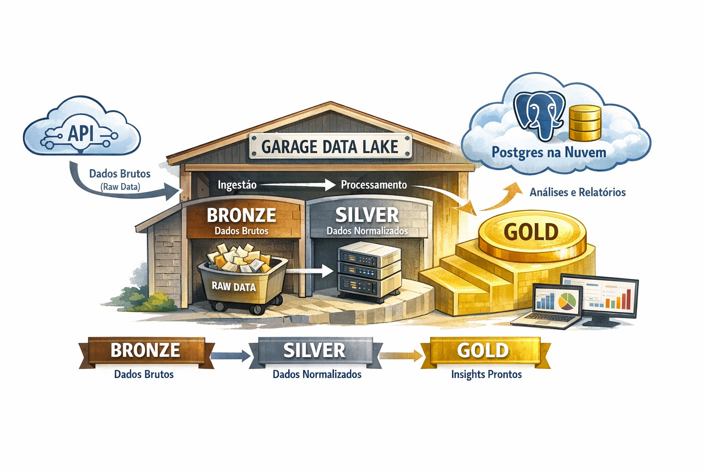

# 🚀 Pipeline de Dados



## 🧠 Pipeline de Dados (Bronze → Silver → Gold)

Este projeto implementa um pipeline de dados moderno utilizando:

* **Garage (S3 local)** → armazenamento de dados
* **DuckDB** → processamento analítico
* **Postgres** → camada de consumo (BI / Analytics)

### 🔄 Fluxo completo

```
        ┌──────────────┐
        │   API / Raw  │
        └──────┬───────┘
               │
               ▼
        ┌──────────────┐
        │   Bronze     │  (Garage / S3)
        │ raw/orders   │
        └──────┬───────┘
               │
               ▼
        ┌──────────────┐
        │   Silver     │  (DuckDB + Parquet)
        │ dim + fact   │
        └──────┬───────┘
               │
               ▼
        ┌──────────────┐
        │    Gold      │  (Postgres)
        │ métricas BI  │
        └──────────────┘
```

---

## 📦 Papel do Garage no pipeline

O **Garage atua como o Data Lake (S3)** da arquitetura.

### Ele é usado para:

* armazenar dados **raw (bronze)** vindos de APIs
* armazenar dados **tratados (silver)** em formato Parquet
* desacoplar ingestão de processamento
* simular um ambiente real de cloud (AWS S3)

👉 Ou seja:

> O Garage substitui completamente o S3, mantendo o mesmo código (`boto3`), mas rodando localmente.

---

# 🥈 Camada Silver (o que seu código faz)


## 🥈 Camada Silver — Transformação com DuckDB

O script de **silver** realiza as seguintes etapas:

### 1. Leitura do dado bruto (Garage / S3)

```python
s3.get_object(...)
```

* Busca o arquivo mais recente em `orders/raw/`
* Carrega os dados em memória

---

### 2. Processamento com DuckDB

```python
con = duckdb.connect()
```

DuckDB é usado como engine analítica para transformar dados localmente.

---

### 3. Normalização dos dados

O dataset original contém estruturas aninhadas (`cart.products`).

O código:

#### 🔹 Flatten (desnormalização inicial)

```sql
CREATE TABLE orders_flat AS ...
```

Extrai os campos principais do carrinho.

---

#### 🔹 Criação de dimensão (`dim_products`)

```sql
SELECT DISTINCT ...
```

* Um produto por linha
* Remove duplicatas
* Estrutura dimensional (modelo estrela)

---

#### 🔹 Criação de fato (`fact_orders`)

```sql
GROUP BY id ...
```

* Uma linha por pedido
* Contém métricas agregadas
* Lista de produtos (`product_ids`)

---

### 4. Escrita no Garage (Silver)

```python
s3.put_object(...)
```

Os dados são salvos como:

```
orders/silver/dim_products/
orders/silver/fact_orders/
```

👉 Formato: **Parquet (colunar, otimizado para analytics)**

---

# 🥇 Camada Gold


## 🥇 Camada Gold — Métricas para Analytics

A camada **gold** é responsável por transformar dados em **informação pronta para consumo**.

---

### 1. Leitura da Silver

O código:

* lê os arquivos Parquet do Garage
* recria tabelas no DuckDB

```sql
SELECT * FROM read_parquet(...)
```

---

### 2. Criação de métricas

Exemplo:

```sql
CREATE TABLE gold_user_metrics AS
SELECT ...
```

Métricas criadas:

* total de pedidos por usuário
* valor total gasto
* valor com desconto
* quantidade de itens
* ticket médio

---

### 3. Carga no Postgres

```python
psycopg2.connect(...)
```

Os dados são enviados para o Postgres, que atua como:

* Data Warehouse leve
* Fonte para BI tools (ex: Superset, Power BI)

---

### 4. Estrutura final no banco

#### 📦 `dim_products`

Tabela dimensional de produtos

#### 📊 `fact_orders`

Tabela fato com pedidos

#### 🥇 `gold_user_metrics`

Tabela agregada pronta para análise

---
# 🗄️ Garage — Object Storage Local (Substituto do S3)

## Por que Garage em vez do S3?

| Critério | AWS S3 | Garage (self-hosted) |
|---|---|---|
| Custo | Pago por GB + requests | Gratuito (usa disco local) |
| Latência | Depende da região AWS | Milissegundos (localhost) |
| Privacidade | Dados na nuvem AWS | Dados no seu servidor |
| API | S3 nativa | 100% compatível com S3 |
| Setup | Conta AWS, IAM, políticas | Um container Docker |
| Offline | ❌ Requer internet | ✅ Funciona offline |

> **Resumo**: Garage expõe exatamente a mesma API do S3. Seu código Python com `boto3` não precisa mudar, apenas o `endpoint_url` aponta para `localhost:3900` em vez da AWS. Ideal para desenvolvimento local, dados sensíveis ou ambientes sem acesso à internet.

---

## Arquitetura: Como as peças se encaixam

```
┌─────────────────────────────────────────────────────────┐
│                      Docker Container                    │
│                                                         │
│   ┌─────────────┐    ┌──────────────────────────────┐   │
│   │ garage.toml │───▶│         Garage daemon         │   │
│   │ (config)    │    │                              │   │
│   └─────────────┘    │  :3900  ← S3 API (boto3)     │   │
│                      │  :3901  ← Admin REST API      │   │
│   ┌─────────────┐    │  :3902  ← RPC (cluster)       │   │
│   │    /meta    │───▶│  :3903  ← Web UI (opcional)   │   │
│   │ (metadados) │    │                              │   │
│   └─────────────┘    └──────────────────────────────┘   │
│                                                         │
│   ┌─────────────┐                                       │
│   │    /data    │  ← Seus arquivos ficam aqui           │
│   │  (objetos)  │                                       │
│   └─────────────┘                                       │
└─────────────────────────────────────────────────────────┘
         │
         │ porta 3900
         ▼
┌─────────────────┐
│  Python / boto3 │  ← mesmo código que usaria com AWS S3
│  endpoint_url=  │
│  localhost:3900  │
└─────────────────┘
```

**Por que três volumes?**
- `garage.toml` → configuração do nó (zona, capacidade, segredos)
- `/meta` → índice de objetos, chaves, buckets (leve, crítico para backup)
- `/data` → conteúdo binário dos objetos (pesado, onde ficam seus arquivos)

**Por que quatro portas?**
- `3900` → API S3 — a que seu código usa
- `3901` → API Admin — usada pelos comandos `garage` CLI
- `3902` → RPC interno — para clusters multi-nó (não usada aqui)
- `3903` → Endpoint web estático — servir arquivos públicos diretamente

---

## Pré-requisito: `garage.toml`

Antes de subir o container, crie o arquivo de configuração mínimo:

```toml
# /path/to/garage.toml
metadata_dir = "/var/lib/garage/meta"
data_dir     = "/var/lib/garage/data"

replication_factor = 1   # 1 nó = sem replicação (suficiente para dev)

[rpc_secret]
# Gere com: openssl rand -hex 32
secret = "sua_chave_aleatoria_de_64_caracteres_hexadecimais_aqui"

[s3_api]
s3_region = "garage"
api_bind_addr = "0.0.0.0:3900"

[admin]
api_bind_addr = "0.0.0.0:3901"
```

> **Por que `replication_factor = 1`?** Em produção com múltiplos nós você usaria 2 ou 3 para redundância. Para desenvolvimento local, 1 é suficiente e mais simples.

---

## Setup Completo (ordem importa)

### Passo 1 — Subir o container

```bash
docker run \
  -d \
  --name garaged \
  -p 3900:3900 \   # S3 API — seu código conecta aqui
  -p 3901:3901 \   # Admin API — comandos CLI usam aqui
  -p 3902:3902 \   # RPC (cluster multi-nó)
  -p 3903:3903 \   # Web endpoint (servir arquivos públicos)
  -v /path/to/garage.toml:/etc/garage.toml \
  -v /path/to/garage/meta:/var/lib/garage/meta \
  -v /path/to/garage/data:/var/lib/garage/data \
  dxflrs/garage:v2.2.0
```

---

### Passo 2 — Configurar o layout do nó (única vez)

O Garage precisa saber **onde** e **quanto** armazenar antes de aceitar qualquer dado. Esse é um conceito de "layout de cluster" — mesmo com um único nó, ele precisa ser explicitamente registrado.

**2a. Descobrir o ID do nó:**

```bash
docker exec garaged /garage status
```

Saída esperada:
```
==== HEALTHY NODES ====
ID                  Hostname  ...
e7b63350c4a543b8    garaged   ...
```

**2b. Registrar o nó no layout** (substitua pelo seu ID real):

```bash
docker exec garaged /garage layout assign e7b63350c4a543b8 \
  --zone dc1 \        # nome lógico da zona (qualquer string)
  --capacity 1G       # espaço que este nó pode usar
```

> **O que é `--zone`?** Em clusters distribuídos, zonas representam datacenters ou racks. Com um único nó, o nome não importa — use qualquer string.

**2c. Aplicar o layout:**

```bash
docker exec garaged /garage layout apply --version 1
```

> **Por que `--version 1`?** O Garage usa versionamento de layout para evitar race conditions em clusters. Na primeira aplicação, sempre use `1`. Futuras mudanças incrementam o número.

**2d. Verificar que está saudável:**

```bash
docker exec garaged /garage status
```

Deve mostrar o nó como `HEALTHY` sem warnings.

---

### Passo 3 — Criar credenciais de acesso

O Garage usa o mesmo modelo de autenticação do S3: **Access Key ID** + **Secret Key**. Cada chave tem permissões configuráveis por bucket.

```bash
docker exec garaged /garage key create my-key
```

Saída (guarde esses valores):
```
Key name:   my-key
Key ID:     aaaaaaaaaaaaaaaaaaa
Secret key: ZZZZZZZZZZZZZZZZZZZZZZZZZZZZZZZZZZZZZZZZZZZZZZZZZZZ
```

---

### Passo 4 — Criar o bucket

```bash
docker exec garaged /garage bucket create bucket_name
```

> **O que é um bucket?** É o equivalente a uma pasta raiz no S3 — todos os objetos ficam dentro de buckets. O nome precisa ser globalmente único dentro da sua instância Garage.

---

### Passo 5 — Conceder acesso da chave ao bucket

```bash
docker exec garaged /garage bucket allow bucket_name \
  --read \    # pode fazer GetObject, ListObjects
  --write \   # pode fazer PutObject, DeleteObject
  --owner \   # pode gerenciar o bucket (lifecycle, CORS, etc.)
  --key my-key
```

> **Por que separar chave e bucket?** Segurança por princípio do menor privilégio. Em produção você pode ter uma chave de leitura para um serviço de relatórios e outra de escrita para o pipeline de ingestão — no mesmo bucket.

---

### Passo 6 — Conectar via boto3

```python
import boto3

s3 = boto3.client(
    "s3",
    endpoint_url="http://localhost:3900",        # aponta para o Garage, não AWS
    aws_access_key_id="aws_access_key_id",
    aws_secret_access_key="aws_secret_access_key",
    region_name="garage",                        # deve bater com s3_region no .toml
)

bucket_name = "bucket_name"

# Bucket já existe — remova qualquer create_bucket automático:
# try:
#     s3.create_bucket(Bucket=bucket_name)   ← delete isso
# except:
#     pass

# Upload normal — mesma API do S3
s3.upload_file("arquivo.csv", bucket_name, "pasta/arquivo.csv")

# Download
s3.download_file(bucket_name, "pasta/arquivo.csv", "local.csv")

# Listar objetos
response = s3.list_objects_v2(Bucket=bucket_name)
for obj in response.get("Contents", []):
    print(obj["Key"], obj["Size"])
```

> **Por que remover o `create_bucket`?** O bucket foi criado via CLI com o layout correto. Tentar criá-lo programaticamente novamente retorna erro `BucketAlreadyOwnedByYou`, não é um bug, mas gera ruído desnecessário.

---

## Referência de comandos úteis

```bash
# Ver todos os buckets
docker exec garaged /garage bucket list

# Ver todas as chaves de acesso
docker exec garaged /garage key list

# Ver detalhes de um bucket (permissões, tamanho)
docker exec garaged /garage bucket info bucket_name

# Remover uma chave
docker exec garaged /garage key delete my-key

# Status detalhado do cluster
docker exec garaged /garage status

# Ver logs em tempo real
docker logs -f garaged
```

---

## Troubleshooting

| Erro | Causa provável | Solução |
|---|---|---|
| `Connection refused` na porta 3900 | Container não está rodando | `docker ps` / `docker logs garaged` |
| `InvalidAccessKeyId` | Key ID incorreto no boto3 | Copie o Key ID exato do `garage key create` |
| `SignatureDoesNotMatch` | Secret key incorreta | Copie a Secret key exata (ela só aparece uma vez) |
| `NoSuchBucket` | Bucket não criado ou nome errado | `garage bucket list` para ver os buckets existentes |
| `Layout not configured` | Pulou o passo de layout | Execute os passos 2a–2d novamente |
| `AccessDenied` | Chave sem permissão no bucket | `garage bucket allow` com as flags corretas |
